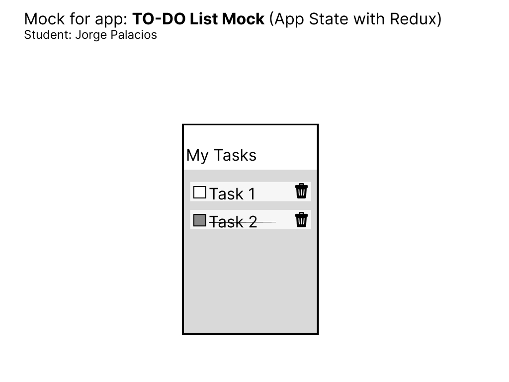

# Challenge: Redux

Jorge Palacios

## Description

### Idea

The main goal of this exercise was to comply with the challenge's requirements in terms of pulling data from the global state using Redux. To accomplish that, I created a list of tasks in the `data` folder, and then followed the steps to load the global state using redux and popullating such state with the mentioned data.

### Challenges

I need to keep working on styling and handling events. However, I could successfully create a `MyTask` component, pass it values and handle its styles from that point forward.

I realized Ract Native doesn't have a Checkbox as it was deprecated. To solve this problem I researched a little bit and found the `react-native-paper` project and its Component Library that includes both Checkbox and RadioButton components.

## Mock

Finally, as requested, please find attached the mock.

